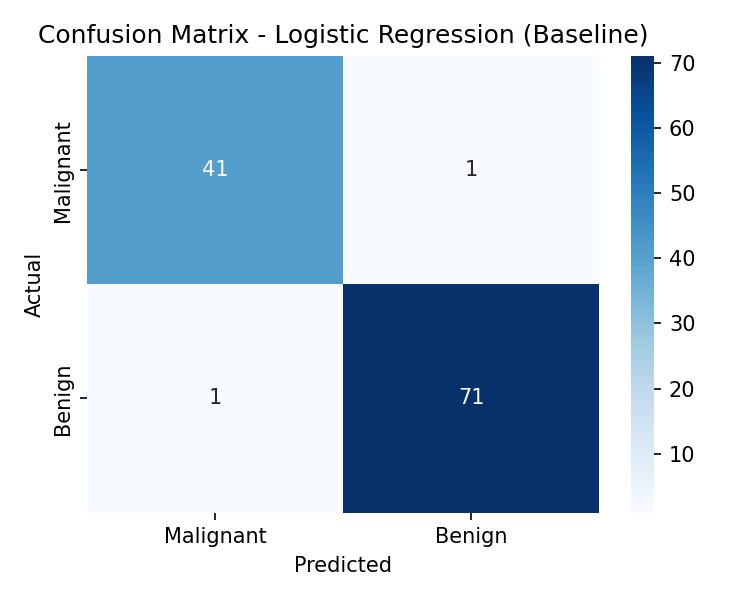
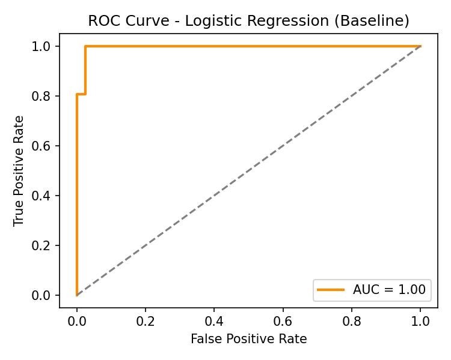
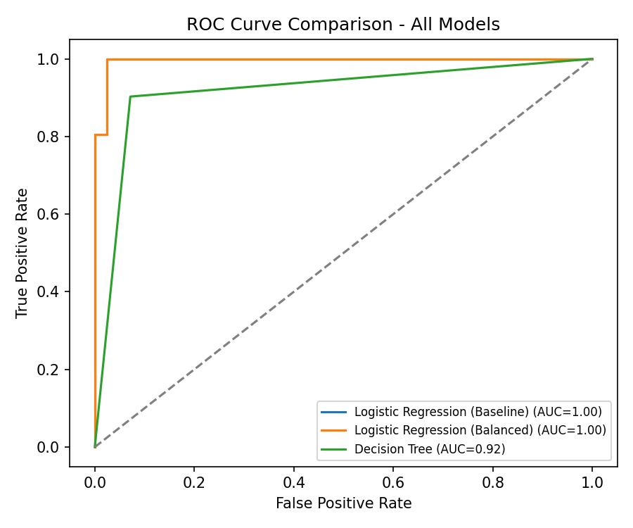

# AI & Machine Learning - Task 4
## Classification Models, Evaluation Metrics & Handling Imbalanced Data

**Internship Program | Maincrafts Technology**  
**Intern:** Anuj  
**Dataset:** Breast Cancer Wisconsin (Diagnostic)

---

## Problem Overview

A binary classification system to predict whether a tumor is **Malignant (0)** or **Benign (1)** using the scikit-learn Breast Cancer Wisconsin dataset.

| Detail | Value |
|--------|-------|
| Total Samples | 569 |
| Features | 30 numeric |
| Malignant | 212 (37%) |
| Benign | 357 (63%) |
| Class Imbalance | Moderate |

---

## Results Summary

| Model | Accuracy | Precision | Recall | F1-Score | AUC |
|-------|----------|-----------|--------|----------|-----|
| **Logistic Regression (Baseline)** | **0.9825** | **0.9861** | **0.9861** | **0.9861** | **0.9954** |
| Logistic Regression (Balanced) | 0.9561 | 0.9855 | 0.9444 | 0.9645 | 0.9954 |
| Decision Tree | 0.9123 | 0.9559 | 0.9028 | 0.9286 | 0.9157 |

### 🏆 Final Model: Logistic Regression (Baseline)
- **Accuracy:** 98.25% — best across all models
- **Recall (Malignant):** 98.61% — only 1 cancer case missed out of 42
- **AUC:** 0.9954 — near-perfect class separation
- **No overfitting** — stable, generalizable, interpretable

---

## Why Not Just Accuracy?

Accuracy is misleading on imbalanced data. A model predicting **Benign every time** would still score ~63% accuracy while **never detecting a single cancer case**.

Instead, the following metrics were prioritised:

- **Recall** — most critical for medical diagnosis; a missed cancer (false negative) is far more dangerous than a false alarm
- **F1-Score** — harmonic mean of precision and recall; penalises models that sacrifice one for the other
- **AUC** — threshold-independent measure of class separation ability
- **Confusion Matrix** — exposes exactly where the model fails

---

## Imbalance Handling

The dataset has a moderate imbalance (37% Malignant vs 63% Benign). Technique used: **class-weight balancing** (`class_weight="balanced"`).

| Technique | Why chosen |
|-----------|-----------|
| Class-weight balancing | Simple, robust, no data loss, no synthetic samples |
| Not undersampling | Would discard real data from a small dataset |
| Not SMOTE | Unnecessary for this dataset size and imbalance level |

> In practice, the baseline already performed very well. Balancing shifted the precision/recall trade-off slightly — confirming that this technique is most impactful on severely skewed datasets.

---

## Key Visualisations

### Confusion Matrix — Logistic Regression (Baseline)

> Only 2 misclassifications out of 114 test samples (1 false positive, 1 false negative)

### ROC Curve — Logistic Regression (Baseline)

> AUC = 1.00 — hugs the top-left corner, indicating near-perfect discrimination

### ROC Curve Comparison — All Models

> Logistic Regression (both variants) clearly outperforms the Decision Tree (AUC 0.92 vs 1.00)

---

## Project Structure

```
├── AI_ML_Task4_Classification_Evaluation.ipynb   # Main Jupyter Notebook
├── AI_ML_Task4_Report.pdf                        # Full 2-3 page report
├── confusion_matrix.png                          # Confusion matrix heatmap
├── roc_curve.png                                 # ROC curve (baseline model)
├── roc_comparison.png                            # ROC comparison (all models)
└── README.md                                     # This file
```

---

## Tools & Technologies

- Python 3.x
- Jupyter Notebook
- pandas, NumPy
- scikit-learn (LogisticRegression, DecisionTreeClassifier, classification_report, roc_auc_score)
- matplotlib, seaborn

---

## Concepts Covered

| Concept | Purpose |
|---------|---------|
| Binary Classification | Malignant vs Benign tumour prediction |
| Confusion Matrix | Expose TP, TN, FP, FN directly |
| Precision & Recall | Handle class imbalance intelligently |
| F1-Score | Single balanced metric for imbalanced data |
| ROC Curve & AUC | Threshold-independent model quality check |
| Class-Weight Balancing | Handle imbalanced classes without data loss |
| Logistic Regression | Baseline linear classifier with interpretable coefficients |
| Decision Tree | Rule-based classifier; compared for overfitting behaviour |

---

## How to Run

```bash
git clone https://github.com/<your-username>/AI-ML-Task4-Maincrafts.git
cd AI-ML-Task4-Maincrafts
pip install pandas numpy matplotlib seaborn scikit-learn jupyter
jupyter notebook AI_ML_Task4_Classification_Evaluation.ipynb
```

---

## Key Learnings

- **Accuracy alone is not enough** — especially in medical classification where class imbalance exists
- **Recall is the priority metric** for cancer detection — missing a malignant case is far costlier than a false alarm
- **Logistic Regression outperformed Decision Tree** — simpler, well-regularised models often generalise better
- **Class-weight balancing** is a lightweight, effective first step before trying SMOTE or resampling
- **AUC = 0.9954** confirms the model is not just accurate but genuinely separating the two classes

---

## Connection to Previous Tasks

| Task | Focus | Link |
|------|-------|------|
| Task 2 | Regression — House Price Prediction | Feature scaling, model comparison |
| Task 3 | Model Validation — Overfitting & Hyperparameter Tuning | Cross-validation, GridSearchCV |
| **Task 4** | **Classification — Imbalanced Medical Data** | **Precision, Recall, F1, AUC, ROC** |

---

*Part of the AI & Machine Learning Internship at Maincrafts Technology*
